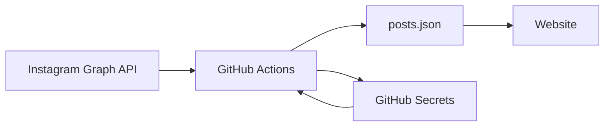

# Instagram統合アーキテクチャ

## 概要

Club TRIAXのウェブサイトにInstagram投稿を自動的に表示し、定期的に更新するシステムのアーキテクチャドキュメントです。

## システム構成

### コンポーネント



### 主要コンポーネント

1. **Instagram Graph API**
   - Long-lived Access Token（60日有効）
   - User ID: 17841443759135863

2. **GitHub Actions Workflows**
   - `fetch-instagram-posts.yml`: 12時間ごとに投稿を取得
   - `refresh-instagram-token.yml`: 月2回トークンを更新

3. **データストレージ**
   - `docs/assets/instagram/posts.json`: 投稿データ
   - GitHub Secrets: トークンの安全な保存

## データフロー

### 投稿取得フロー

1. **定期実行**（12時間ごと）
   ```
   GitHub Actions → Instagram API → posts.json → Website
   ```

2. **更新判定**
   - media_urlの有効期限を考慮して毎回更新
   - git diffで実際の変更を検出
   - 変更がある場合のみコミット

### トークン更新フロー

1. **定期実行**（月2回：1日と15日）
   ```
   現在のトークン → Refresh API → 新トークン（+60日） → GitHub Secrets
   ```

2. **実行環境別の動作**

   | Runtime | Input | Output |
   |---------|-------|--------|
   | GitHub Actions | secrets.FACEBOOK_ACCESS_TOKEN | GitHub Secrets API |
   | Local Dev | .env file | .env file + backup |

## セキュリティ考慮事項

### トークン管理

1. **保存場所**
   - 本番: GitHub Secrets（暗号化）
   - 開発: .envファイル（gitignore）

2. **有効期限管理**
   - 60日の有効期限
   - 30日ごとの自動更新
   - 期限警告の実装

3. **アクセス制限**
   - mainブランチのみで実行
   - 環境変数経由でのみアクセス

### media_url の有効期限

- **問題**: Instagram APIのmedia_urlは24-48時間で期限切れ
- **対策**: 12時間ごとに必ず更新
- **影響**: 画像表示の継続性を保証

## エラーハンドリング

### トークン更新失敗時

1. GitHub Issueの自動作成
2. ラベル付け（bug, instagram, urgent）
3. 手動介入手順の記載

### API制限

- Rate limiting考慮
- タイムアウト設定（15秒）
- リトライなし（次回実行を待つ）

## 技術的決定事項

### なぜ12時間ごとか

1. media_urlの有効期限（24-48時間）に対する安全マージン
2. APIレート制限の回避
3. 更新頻度とコストのバランス

### なぜ比較ロジックを削除したか

1. media_urlが頻繁に変わるため
2. git diffで十分な重複排除が可能
3. シンプルな実装の維持

### libsodium-wrappers の採用理由

1. GitHub Secrets APIの要求仕様
2. セキュリティの専門性
3. 実績のあるライブラリ

## 関連ドキュメント

- [Instagram Secrets設定手順](../04-operations/instagram-secrets-setup.md)
- [Instagram Token更新手順](../04-operations/instagram-token-refresh.md)
- [トラブルシューティング](../05-troubleshooting/instagram-issues.md)
