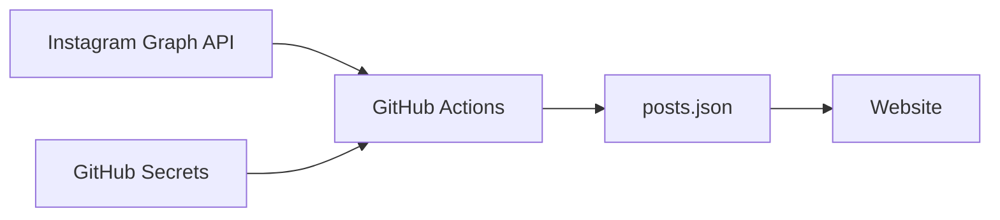

# Instagram統合アーキテクチャ

## 概要

Club TRIAXのウェブサイトにInstagram投稿を自動的に表示し、定期的に更新するシステムのアーキテクチャドキュメントです。

## システム構成

### コンポーネント



### 主要コンポーネント

1. **Instagram Graph API**
   - **Page Access Token（無期限）** ← 推奨
   - Instagram Business Account ID: 17841443759135863

2. **GitHub Actions Workflows**
   - `fetch-instagram-posts.yml`: 12時間ごとに投稿を取得

3. **データストレージ**
   - `docs/assets/instagram/posts.json`: 投稿データ
   - GitHub Secrets: トークンの安全な保存

## Access Tokenアーキテクチャ

### トークンの種類と推奨

```
┌─────────────────────────────────────────────────────────────────┐
│                    Access Token の種類                          │
├─────────────────────────────────────────────────────────────────┤
│                                                                 │
│  [推奨] Page Access Token                                       │
│  ├─ 有効期限: 無期限（Never Expire）                            │
│  ├─ 取得方法: pnpm instagram:get-page-token                     │
│  ├─ 更新: 不要                                                  │
│  └─ 環境変数: FACEBOOK_PAGE_ACCESS_TOKEN                        │
│                                                                 │
│  [非推奨] User Access Token (Long-Lived)                        │
│  ├─ 有効期限: 60日                                              │
│  ├─ 問題: fb_exchange_tokenでは延長不可（後述）                 │
│  ├─ 更新: 60日ごとに手動で再取得が必要                          │
│  └─ 環境変数: FACEBOOK_ACCESS_TOKEN（レガシー）                 │
│                                                                 │
└─────────────────────────────────────────────────────────────────┘
```

### 環境変数

| 変数名 | 説明 | 必須 |
|--------|------|------|
| `FACEBOOK_PAGE_ACCESS_TOKEN` | Page Access Token（無期限）| ✅ 推奨 |
| `INSTAGRAM_BUSINESS_ACCOUNT_ID` | Instagram Business Account ID | ✅ 推奨 |
| `FACEBOOK_ACCESS_TOKEN` | User Access Token（レガシー）| フォールバック |
| `INSTAGRAM_USER_ID` | Instagram User ID（レガシー）| フォールバック |

スクリプトは新しい変数を優先し、なければレガシー変数にフォールバックします。

## fb_exchange_token の問題（重要）

### 発見された問題

2024年12月の調査で、`fb_exchange_token` グラントタイプに重大な制限があることが判明しました。

```
┌─────────────────────────────────────────────────────────────────┐
│  fb_exchange_token の実際の挙動                                 │
├─────────────────────────────────────────────────────────────────┤
│                                                                 │
│  短期トークン → Long-Lived Token                                │
│  ✅ 正常に動作（60日トークンを取得）                            │
│                                                                 │
│  Long-Lived Token → Long-Lived Token (リフレッシュ)             │
│  ❌ 同じトークン・同じ有効期限が返される                        │
│     → 実質的にリフレッシュされない                              │
│                                                                 │
└─────────────────────────────────────────────────────────────────┘
```

### 証拠（GitHub Actions実行ログより）

| 実行日 | 更新前の残り日数 | 更新後の残り日数 |
|--------|------------------|------------------|
| 10/15 | 51日 | 51日（変化なし）|
| 11/1 | 34日 | 34日（変化なし）|
| 11/15 | 20日 | 20日（変化なし）|
| 12/1 | 4日 | 4日（変化なし）|

### 原因

Facebook Graph APIの仕様として、Long-Lived User Access Tokenを`fb_exchange_token`でリフレッシュしようとしても、**同じトークンがそのまま返される**。これはWebアプリケーションの制限であり、ネイティブモバイルアプリのみが自動リフレッシュをサポートしています。

### 解決策

**Page Access Token（無期限）を使用する**ことで、この問題を完全に回避できます。

## Page Access Token 取得フロー

### 初回セットアップ

```bash
# 1. Graph API Explorerで短期トークンを取得
#    https://developers.facebook.com/tools/explorer
#    権限: instagram_basic, pages_show_list, pages_read_engagement

# 2. 短期トークンをLong-lived User Access Tokenに変換
#    .envのFACEBOOK_ACCESS_TOKENに短期トークンを設定後:
pnpm instagram:exchange-slt2llt

# 3. Page Access Token（無期限）を取得
pnpm instagram:get-page-token

# 4. 動作確認
pnpm instagram:fetch

# 5. GitHub Secretsを更新
#    - FACEBOOK_PAGE_ACCESS_TOKEN
#    - INSTAGRAM_BUSINESS_ACCOUNT_ID
```

### スクリプト一覧

| スクリプト | 用途 | 使用頻度 |
|-----------|------|----------|
| `instagram:get-page-token` | Page Access Token（無期限）を取得 | 初回のみ |
| `instagram:exchange-slt2llt` | 短期→Long-lived変換 | 必要時のみ |
| `instagram:fetch` | Instagram投稿を取得 | 12時間ごと（自動）|
| `instagram:refresh-token` | ~~Token更新~~ | **非推奨（機能しない）** |

## データフロー

### 投稿取得フロー

1. **定期実行**（12時間ごと）
   ```
   GitHub Actions → Instagram API → posts.json → Website
   ```

2. **更新判定**
   - media_urlの有効期限を考慮して毎回更新
   - git diffで実際の変更を検出
   - 変更がある場合のみコミット

## Page Access Token の運用

### 定期的なリフレッシュは不要

Page Access Token は **技術的に無期限（Never Expire）** です。
User Access Token のように60日で期限切れになることはありません。

```
┌─────────────────────────────────────────────────────────────────┐
│  なぜリフレッシュ不要か                                         │
├─────────────────────────────────────────────────────────────────┤
│                                                                 │
│  User Access Token（60日有効）                                  │
│  └─ 時間経過で自動的に期限切れ → 定期リフレッシュ必要           │
│     └─ しかし fb_exchange_token では延長不可（前述）            │
│                                                                 │
│  Page Access Token（無期限）                                    │
│  └─ 時間経過では期限切れにならない → リフレッシュ不要           │
│     └─ 外部要因でのみ無効化される（下記参照）                   │
│                                                                 │
└─────────────────────────────────────────────────────────────────┘
```

### Page Access Token が無効化されるケース

以下のケースでのみ無効化されます（いずれも稀）：

| ケース | 発生頻度 | 対処法 |
|--------|----------|--------|
| Facebookアプリが削除された | 非常に稀 | アプリを再作成し、トークンを再取得 |
| ページ管理者の権限が剥奪された | 稀 | 権限を持つ管理者で再取得 |
| ユーザーがアプリ連携を解除した | 稀 | 再度連携してトークンを再取得 |
| Facebookのポリシー変更 | 非常に稀 | 新しい要件に従って再取得 |
| アプリのセキュリティ違反検出 | 非常に稀 | Facebookの指示に従う |

### トークン無効化の検知

`fetch-instagram-posts.yml` ワークフローが失敗した場合、トークンが無効化された可能性があります。
GitHub Actions の失敗通知で検知できるため、**別途の監視ワークフローは不要**です。

### 復旧手順

トークンが無効化された場合：

```bash
# 1. Graph API Explorerで新しい短期トークンを取得
#    https://developers.facebook.com/tools/explorer

# 2. Long-lived User Access Tokenに変換
pnpm instagram:exchange-slt2llt

# 3. Page Access Token（無期限）を再取得
pnpm instagram:get-page-token

# 4. 動作確認
pnpm instagram:fetch

# 5. GitHub Secretsを更新
#    - FACEBOOK_PAGE_ACCESS_TOKEN
#    - INSTAGRAM_BUSINESS_ACCOUNT_ID
```

## セキュリティ考慮事項

### トークン管理

1. **保存場所**
   - 本番: GitHub Secrets（暗号化）
   - 開発: .envファイル（gitignore）

2. **アクセス制限**
   - mainブランチのみで実行
   - 環境変数経由でのみアクセス

### media_url の有効期限

- **問題**: Instagram APIのmedia_urlは24-48時間で期限切れ
- **対策**: 12時間ごとに必ず更新
- **影響**: 画像表示の継続性を保証

## エラーハンドリング

### トークン無効化時

Page Access Tokenが無効化された場合（稀）:

1. エラーログを確認
2. 上記「Page Access Token 取得フロー」を再実行
3. GitHub Secretsを更新

### API制限

- Rate limiting考慮
- タイムアウト設定（15秒）
- リトライなし（次回実行を待つ）

## 技術的決定事項

### なぜPage Access Tokenか

1. **無期限**: 定期的な更新作業が不要
2. **安定性**: fb_exchange_tokenの問題を回避
3. **シンプル**: 複雑なリフレッシュロジックが不要

### なぜ12時間ごとか

1. media_urlの有効期限（24-48時間）に対する安全マージン
2. APIレート制限の回避
3. 更新頻度とコストのバランス

### refresh-instagram-token.yml について

このワークフローは**現在機能していません**（fb_exchange_tokenの制限により）。
Page Access Token採用後は、このワークフローは不要となり、将来的に削除予定です。

## 関連ドキュメント

- [Instagram Secrets設定手順](../04-operations/instagram-secrets-setup.md)
- [トラブルシューティング](../05-troubleshooting/instagram-issues.md)
- `.env.example` - 環境変数の詳細な説明
